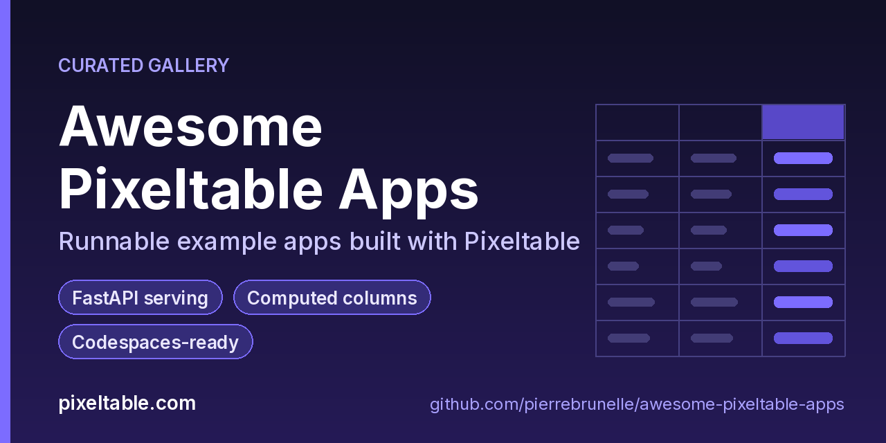

<!-- generated by scripts/update-hub.sh from the published app list; edits here are overwritten -->
# Awesome Pixeltable Apps 

A curated, growing collection of **runnable example apps built with [Pixeltable](https://pixeltable.com)**. Each app is a small, self-contained REST API you can open in **GitHub Codespaces** with one click, run locally, or deploy to **Pixeltable Cloud**.

**🌐 Browse the gallery: https://pierrebrunelle.github.io/awesome-pixeltable-apps/**

## What is Pixeltable?

[Pixeltable](https://pixeltable.com) is open-source, Python-native **multimodal AI data infrastructure**: you declare tables as Python classes, derive values with **incremental computed columns** and plain-Python **UDFs**, add **indexes**, store images and other media as first-class columns, and serve it all as a REST API with `FastAPIRouter`, locally or on Pixeltable Cloud.

- 🌐 Website: https://pixeltable.com
- 📚 Docs: https://docs.pixeltable.com
- 💻 Source: https://github.com/pixeltable/pixeltable

> ⭐ **Find these useful?** Star [pixeltable/pixeltable](https://github.com/pixeltable/pixeltable) on GitHub. It helps other developers discover it.

## Apps

22 apps, newest first.

| App | What it does | Pixeltable features | Try it |
|-----|--------------|---------------------|--------|
| **[Forge Heat Cycles](https://github.com/pierrebrunelle/pixeltable-forge-heats)** 2026-10-10 | Forge heat-cycle registry API: B-tree indexes, chained risk UDFs, and parallel shop-floor writers | B-tree indexes, Concurrency, Computed columns & UDFs, FastAPI serving |  |
| **[Climbing Route Topos](https://github.com/pierrebrunelle/pixeltable-climbing-routes)** 2026-10-09 | Climbing-route topo registry API: photo uploads with thumbnails, grayscale copies, grade bands and index-backed crag lookups | Media (images), B-tree indexes, pxt CLI & dashboard, FastAPI serving, Computed columns & UDFs |  |
| **[Warehouse Pick Lists](https://github.com/pierrebrunelle/pixeltable-warehouse-picklists)** 2026-10-08 | Warehouse pick-list REST API: units, pick zones, waves and tote labels as incremental computed columns over Json order lines | Data reads & writes, Computed columns & UDFs, Pixeltable Cloud, FastAPI serving, B-tree indexes |  |
| **[Ferry Booking](https://github.com/pierrebrunelle/pixeltable-ferry-bookings)** 2026-10-07 | Ferry booking REST API: fares and deck classes as incremental computed columns, served with FastAPI | FastAPI serving, Concurrency, Data reads & writes, Computed columns & UDFs, B-tree indexes |  |
| **[Pharmacy Refill](https://github.com/pierrebrunelle/pixeltable-pharmacy-refills)** 2026-10-06 | Pharmacy refill queue API with HMAC-signed receipts keyed by a runtime secret and B-tree indexed lookups | Secrets, B-tree indexes, pxt CLI & dashboard, FastAPI serving, Computed columns & UDFs |  |
| **[Mural Registry](https://github.com/pierrebrunelle/pixeltable-mural-registry)** 2026-10-05 | Public-art mural registry API: wall photo uploads with thumbnails, grayscale copies and color tags | Media (images), Concurrency, Computed columns & UDFs, FastAPI serving, B-tree indexes |  |
| **[Greenhouse Operations](https://github.com/pierrebrunelle/pixeltable-greenhouse-bays)** 2026-10-04 | Greenhouse operations API: bays, climate readings and plantings, sized for Pixeltable Cloud in pixeltable.toml | pixeltable.toml config, Pixeltable Cloud, B-tree indexes, FastAPI serving, Computed columns & UDFs |  |
| **[Vineyard Estate](https://github.com/pierrebrunelle/pixeltable-vineyard-blocks)** 2026-10-03 | Vineyard estate API: blocks, vines, harvests and tastings as four related Pixeltable tables with yield UDFs | Multi-table & schema evolution, pixeltable.toml config, FastAPI serving, Computed columns & UDFs |  |
| **[Trail Permit](https://github.com/pierrebrunelle/pixeltable-trail-permits)** 2026-10-02 | Backcountry trail permit API with check-ins, permit bands and a full Pixeltable Cloud lifecycle | Pixeltable Cloud, pixeltable.toml config, Multi-table & schema evolution, FastAPI serving, Computed columns & UDFs |  |
| **[Marina Berth Booking](https://github.com/pierrebrunelle/pixeltable-marina-berths)** 2026-10-01 | Marina berth booking API: string primary keys, binary columns, berth fees and stay bands as computed columns | Data reads & writes, pixeltable.toml config, Multi-table & schema evolution, FastAPI serving, Computed columns & UDFs |  |
| **[Museum Loans](https://github.com/pierrebrunelle/pixeltable-museum-loans)** 2026-09-30 | Museum object loan tracker API with overdue flags and urgency bands, explorable from the pxt CLI and dashboard | pxt CLI & dashboard, Data reads & writes, Pixeltable Cloud, FastAPI serving, Computed columns & UDFs |  |
| **[Invoice Audit](https://github.com/pierrebrunelle/pixeltable-invoice-audit)** 2026-09-29 | Invoice line-item audit API: a chain of computed columns from subtotal to tax, total and risk band | Computed columns & UDFs, pxt CLI & dashboard, pixeltable.toml config, FastAPI serving |  |
| **[Lab Accession](https://github.com/pierrebrunelle/pixeltable-lab-accession)** 2026-09-28 | Lab sample accession queue API: three related tables, parallel writers and racing claims | Concurrency, Multi-table & schema evolution, Pixeltable Cloud, FastAPI serving, Computed columns & UDFs, B-tree indexes |  |
| **[Fleet Telemetry](https://github.com/pierrebrunelle/pixeltable-fleet-telemetry)** 2026-09-27 | Fleet telemetry API with B-tree indexed lookups and a chained severity/alert UDF pipeline | B-tree indexes, Computed columns & UDFs, Data reads & writes, FastAPI serving |  |
| **[Webhook Vault](https://github.com/pierrebrunelle/pixeltable-webhook-vault)** 2026-09-26 | Webhook registry API that HMAC-signs payloads with a secret from the environment, as computed columns | Secrets, pixeltable.toml config, FastAPI serving, Computed columns & UDFs |  |
| **[Travel Scrapbook](https://github.com/pierrebrunelle/pixeltable-travel-scrapbook)** 2026-09-26 | Travel photo scrapbook API: image uploads, thumbnails and place tags as computed columns | Media (images), Data reads & writes, FastAPI serving, Computed columns & UDFs |  |
| **[Plant Care](https://github.com/pierrebrunelle/pixeltable-plant-care)** 2026-09-26 | Houseplant care API that turns soil moisture and watering history into care advice via computed columns | FastAPI serving, Computed columns & UDFs |  |
| **[Coffee Journal](https://github.com/pierrebrunelle/pixeltable-coffee-journal)** 2026-09-25 | Coffee tasting journal API: roast labels and tasting summaries as computed columns | FastAPI serving, Pixeltable Cloud, Computed columns & UDFs |  |
| **[Habit Tracker](https://github.com/pierrebrunelle/pixeltable-habit-tracker)** 2026-09-24 | Habit tracker API with streak labels as computed columns, deployable to Pixeltable Cloud | FastAPI serving, Pixeltable Cloud, Computed columns & UDFs |  |
| **[Recipe Box](https://github.com/pierrebrunelle/pixeltable-recipe-box)** 2026-09-23 | Recipe box API with ingredient counts and quick-meal search as computed columns and queries | FastAPI serving, Computed columns & UDFs |  |
| **[Bookmark Shelf](https://github.com/pierrebrunelle/pixeltable-bookmark-shelf)** 2026-09-22 | Bookmark manager API that derives domains and tag counts as computed columns, served with FastAPI | FastAPI serving, Computed columns & UDFs |  |
| **[Sticky Notes](https://github.com/pierrebrunelle/pixeltable-sticky-notes)** 2026-09-21 | Sticky-notes REST API where titles and previews are computed columns, served with FastAPI | FastAPI serving, Computed columns & UDFs |  |

## Browse by feature

### FastAPI serving

[Forge Heat Cycles](https://github.com/pierrebrunelle/pixeltable-forge-heats) · [Climbing Route Topos](https://github.com/pierrebrunelle/pixeltable-climbing-routes) · [Warehouse Pick Lists](https://github.com/pierrebrunelle/pixeltable-warehouse-picklists) · [Ferry Booking](https://github.com/pierrebrunelle/pixeltable-ferry-bookings) · [Pharmacy Refill](https://github.com/pierrebrunelle/pixeltable-pharmacy-refills) · [Mural Registry](https://github.com/pierrebrunelle/pixeltable-mural-registry) · [Greenhouse Operations](https://github.com/pierrebrunelle/pixeltable-greenhouse-bays) · [Vineyard Estate](https://github.com/pierrebrunelle/pixeltable-vineyard-blocks) · [Trail Permit](https://github.com/pierrebrunelle/pixeltable-trail-permits) · [Marina Berth Booking](https://github.com/pierrebrunelle/pixeltable-marina-berths) · [Museum Loans](https://github.com/pierrebrunelle/pixeltable-museum-loans) · [Invoice Audit](https://github.com/pierrebrunelle/pixeltable-invoice-audit) · [Lab Accession](https://github.com/pierrebrunelle/pixeltable-lab-accession) · [Fleet Telemetry](https://github.com/pierrebrunelle/pixeltable-fleet-telemetry) · [Webhook Vault](https://github.com/pierrebrunelle/pixeltable-webhook-vault) · [Travel Scrapbook](https://github.com/pierrebrunelle/pixeltable-travel-scrapbook) · [Plant Care](https://github.com/pierrebrunelle/pixeltable-plant-care) · [Coffee Journal](https://github.com/pierrebrunelle/pixeltable-coffee-journal) · [Habit Tracker](https://github.com/pierrebrunelle/pixeltable-habit-tracker) · [Recipe Box](https://github.com/pierrebrunelle/pixeltable-recipe-box) · [Bookmark Shelf](https://github.com/pierrebrunelle/pixeltable-bookmark-shelf) · [Sticky Notes](https://github.com/pierrebrunelle/pixeltable-sticky-notes)

### Computed columns & UDFs

[Forge Heat Cycles](https://github.com/pierrebrunelle/pixeltable-forge-heats) · [Climbing Route Topos](https://github.com/pierrebrunelle/pixeltable-climbing-routes) · [Warehouse Pick Lists](https://github.com/pierrebrunelle/pixeltable-warehouse-picklists) · [Ferry Booking](https://github.com/pierrebrunelle/pixeltable-ferry-bookings) · [Pharmacy Refill](https://github.com/pierrebrunelle/pixeltable-pharmacy-refills) · [Mural Registry](https://github.com/pierrebrunelle/pixeltable-mural-registry) · [Greenhouse Operations](https://github.com/pierrebrunelle/pixeltable-greenhouse-bays) · [Vineyard Estate](https://github.com/pierrebrunelle/pixeltable-vineyard-blocks) · [Trail Permit](https://github.com/pierrebrunelle/pixeltable-trail-permits) · [Marina Berth Booking](https://github.com/pierrebrunelle/pixeltable-marina-berths) · [Museum Loans](https://github.com/pierrebrunelle/pixeltable-museum-loans) · [Invoice Audit](https://github.com/pierrebrunelle/pixeltable-invoice-audit) · [Lab Accession](https://github.com/pierrebrunelle/pixeltable-lab-accession) · [Fleet Telemetry](https://github.com/pierrebrunelle/pixeltable-fleet-telemetry) · [Webhook Vault](https://github.com/pierrebrunelle/pixeltable-webhook-vault) · [Travel Scrapbook](https://github.com/pierrebrunelle/pixeltable-travel-scrapbook) · [Plant Care](https://github.com/pierrebrunelle/pixeltable-plant-care) · [Coffee Journal](https://github.com/pierrebrunelle/pixeltable-coffee-journal) · [Habit Tracker](https://github.com/pierrebrunelle/pixeltable-habit-tracker) · [Recipe Box](https://github.com/pierrebrunelle/pixeltable-recipe-box) · [Bookmark Shelf](https://github.com/pierrebrunelle/pixeltable-bookmark-shelf) · [Sticky Notes](https://github.com/pierrebrunelle/pixeltable-sticky-notes)

### B-tree indexes

[Forge Heat Cycles](https://github.com/pierrebrunelle/pixeltable-forge-heats) · [Climbing Route Topos](https://github.com/pierrebrunelle/pixeltable-climbing-routes) · [Warehouse Pick Lists](https://github.com/pierrebrunelle/pixeltable-warehouse-picklists) · [Ferry Booking](https://github.com/pierrebrunelle/pixeltable-ferry-bookings) · [Pharmacy Refill](https://github.com/pierrebrunelle/pixeltable-pharmacy-refills) · [Mural Registry](https://github.com/pierrebrunelle/pixeltable-mural-registry) · [Greenhouse Operations](https://github.com/pierrebrunelle/pixeltable-greenhouse-bays) · [Lab Accession](https://github.com/pierrebrunelle/pixeltable-lab-accession) · [Fleet Telemetry](https://github.com/pierrebrunelle/pixeltable-fleet-telemetry)

### Media (images)

[Climbing Route Topos](https://github.com/pierrebrunelle/pixeltable-climbing-routes) · [Mural Registry](https://github.com/pierrebrunelle/pixeltable-mural-registry) · [Travel Scrapbook](https://github.com/pierrebrunelle/pixeltable-travel-scrapbook)

### Secrets

[Pharmacy Refill](https://github.com/pierrebrunelle/pixeltable-pharmacy-refills) · [Webhook Vault](https://github.com/pierrebrunelle/pixeltable-webhook-vault)

### pixeltable.toml config

[Greenhouse Operations](https://github.com/pierrebrunelle/pixeltable-greenhouse-bays) · [Vineyard Estate](https://github.com/pierrebrunelle/pixeltable-vineyard-blocks) · [Trail Permit](https://github.com/pierrebrunelle/pixeltable-trail-permits) · [Marina Berth Booking](https://github.com/pierrebrunelle/pixeltable-marina-berths) · [Invoice Audit](https://github.com/pierrebrunelle/pixeltable-invoice-audit) · [Webhook Vault](https://github.com/pierrebrunelle/pixeltable-webhook-vault)

### Concurrency

[Forge Heat Cycles](https://github.com/pierrebrunelle/pixeltable-forge-heats) · [Ferry Booking](https://github.com/pierrebrunelle/pixeltable-ferry-bookings) · [Mural Registry](https://github.com/pierrebrunelle/pixeltable-mural-registry) · [Lab Accession](https://github.com/pierrebrunelle/pixeltable-lab-accession)

### Pixeltable Cloud

[Warehouse Pick Lists](https://github.com/pierrebrunelle/pixeltable-warehouse-picklists) · [Greenhouse Operations](https://github.com/pierrebrunelle/pixeltable-greenhouse-bays) · [Trail Permit](https://github.com/pierrebrunelle/pixeltable-trail-permits) · [Museum Loans](https://github.com/pierrebrunelle/pixeltable-museum-loans) · [Lab Accession](https://github.com/pierrebrunelle/pixeltable-lab-accession) · [Coffee Journal](https://github.com/pierrebrunelle/pixeltable-coffee-journal) · [Habit Tracker](https://github.com/pierrebrunelle/pixeltable-habit-tracker)

### Multi-table & schema evolution

[Vineyard Estate](https://github.com/pierrebrunelle/pixeltable-vineyard-blocks) · [Trail Permit](https://github.com/pierrebrunelle/pixeltable-trail-permits) · [Marina Berth Booking](https://github.com/pierrebrunelle/pixeltable-marina-berths) · [Lab Accession](https://github.com/pierrebrunelle/pixeltable-lab-accession)

### Data reads & writes

[Warehouse Pick Lists](https://github.com/pierrebrunelle/pixeltable-warehouse-picklists) · [Ferry Booking](https://github.com/pierrebrunelle/pixeltable-ferry-bookings) · [Marina Berth Booking](https://github.com/pierrebrunelle/pixeltable-marina-berths) · [Museum Loans](https://github.com/pierrebrunelle/pixeltable-museum-loans) · [Fleet Telemetry](https://github.com/pierrebrunelle/pixeltable-fleet-telemetry) · [Travel Scrapbook](https://github.com/pierrebrunelle/pixeltable-travel-scrapbook)

### pxt CLI & dashboard

[Climbing Route Topos](https://github.com/pierrebrunelle/pixeltable-climbing-routes) · [Pharmacy Refill](https://github.com/pierrebrunelle/pixeltable-pharmacy-refills) · [Museum Loans](https://github.com/pierrebrunelle/pixeltable-museum-loans) · [Invoice Audit](https://github.com/pierrebrunelle/pixeltable-invoice-audit)

## How every app is laid out

- `app.py`: tables declared as Python classes, `@pxt.query` functions and the `FastAPIRouter` routes
- `udfs.py`: the `@pxt.udf` functions, imported by `app.py` (Pixeltable records UDFs by module path)
- `pixeltable.toml`: a local database plus a Pixeltable Cloud database entry
- `seed.py` / `client_demo.py`: sample data and a client that calls every route
- `.devcontainer/devcontainer.json`: one-click GitHub Codespaces (Python 3.12, port 8000 forwarded)

Quickstart in any app: `pip install -r requirements.txt`, `pxt schema update app.py <dir>`, `python seed.py`, `pxt service run app.py <dir> --port 8000`, then open `/docs`.

## License

The list and site are released under the [Apache-2.0](LICENSE) license. Each app carries its own Apache-2.0 license.
